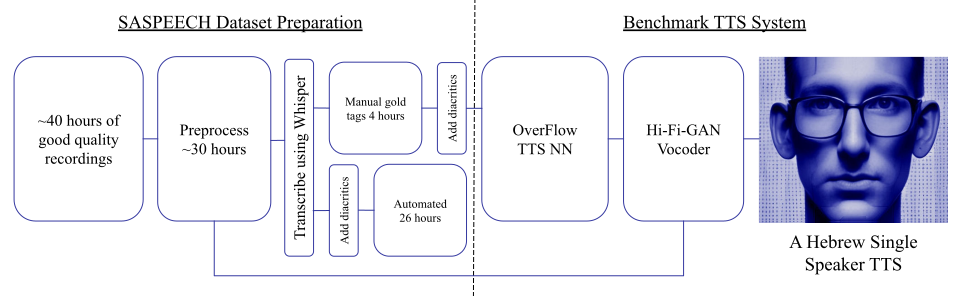

# SASPEECH: A Hebrew Single Speaker Dataset for Text To Speech and Voice Conversion
##### [Orian Sharoni](mailto:orian.sharoni@upai.dev), [Roee Shenberg](mailto:roee.shenberg@upai.dev), [Erica Cooper](https://nii-yamagishilab.github.io/author/erica-cooper/)

We present SASPEECH, a 30-hour single speaker Hebrew corpus accompanied by a text-to-speech (TTS) benchmark. It is the first large-scale high-quality open dataset of its kind. We believe our work will facilitate future generative Hebrew tools and low resource language research. The corpus will be publicly accessible at [https://www.openslr.org/134]. Code for the baseline TTS system available at [https://github.com/shenberg/TTS/](https://github.com/shenberg/TTS/)

Link to dataset coming soon.

## Dataset examples

<table class="dataframe tg">
  <thead>
    <tr style="text-align: center;">
      <th></th>
      <th>Input: Transcription with diacritics</th>
      <th>Original</th>
      <th>OverFlow (7350 steps) + HiFi-GAN</th>
      <th>OverFlow (more training) + HiFi-GAN</th>
    </tr>
  </thead>
  <tbody>
    <tr>
      <th>1</th>
      <td>זוֹ הָיְיתָה אֲוִוירָה מְטוֹרֶפֶת שֶׁל סוֹף הָעוֹלָם.</td>
      <td><audio id="audio-small" controls>
    <source src="wavs/gt/Mom3_0007.wav" type="audio/wav">
</audio></td>
      <td><audio id="audio-small" controls>
    <source src="wavs/tts_paper/078.wav" type="audio/wav">
</audio></td>
      <td><audio id="audio-small" controls>
    <source src="wavs/tts_model2/model_2_Mom3_0007.wav" type="audio/wav">
</audio></td>
    </tr>
    <tr>
      <th>2</th>
      <td>בְּשָׁנָה וָחֵצִי הָאַחֲרוֹנוֹת יָצָא לִי לֶאֱכוֹל כָּאן בְּאַרְהָ״ב אֶת הַמּוּצָרִים שֶׁל שְׁתֵּי הַחֲבָרוֹת</td>
      <td><audio id="audio-small" controls>
    <source src="wavs/gt/Meat_0089.wav" type="audio/wav">
</audio></td>
      <td><audio id="audio-small" controls>
    <source src="wavs/tts_paper/073.wav" type="audio/wav">
</audio></td>
      <td><audio id="audio-small" controls>
    <source src="wavs/tts_model2/model_2_Meat_0089.wav" type="audio/wav">
</audio></td>
    </tr>
    <tr>
      <th>3</th>
      <td>הַיי, אֲנִי שָׁאוּל אַמֶסְטֶרְדְמְסְקִי וְאַתֶּם מַאֲזִינִים לִחְיוֹת כִּיס.</td>
      <td><audio id="audio-small" controls>
    <source src="wavs/gt/Aharon Fogel_0002.wav" type="audio/wav">
</audio></td>
      <td><audio id="audio-small" controls>
    <source src="wavs/tts_paper/003.wav" type="audio/wav">
</audio></td>
      <td><audio id="audio-small" controls>
    <source src="wavs/tts_model2/model_2_Aharon Fogel_0002.wav" type="audio/wav">
</audio></td>
    </tr>
    <tr>
      <th>4</th>
      <td>הוּא רוֹצֶה שֶׁאֲנִי אֶתֵּן דּוּגְמָא</td>
      <td><audio id="audio-small" controls>
    <source src="wavs/gt/Corona4_0007.wav" type="audio/wav">
</audio></td>
      <td><audio id="audio-small" controls>
    <source src="wavs/tts_paper/021.wav" type="audio/wav">
</audio></td>
      <td><audio id="audio-small" controls>
    <source src="wavs/tts_model2/model_2_Corona4_0007.wav" type="audio/wav">
</audio></td>
    </tr>
    <tr>
      <th>5</th>
      <td>וְהוּא אוֹמֵר בְּעֶצֶם דָּבָר אֶחָד וְאֶחָד בִּלְבַד מָה הַיְּכוֹלֶת אוֹ מָה הַסִּיכּוּן שֶׁמֶּמְשָׁלָה כָּלְשֶׁהִי תַּחֲזִיר אֶת הַהַשְׁקָעָה אוֹ יוֹתֵר נָכוֹן</td>
      <td><audio id="audio-small" controls>
    <source src="wavs/gt/Credit Rating_0006.wav" type="audio/wav">
</audio></td>
      <td><audio id="audio-small" controls>
    <source src="wavs/tts_paper/024.wav" type="audio/wav">
</audio></td>
      <td><audio id="audio-small" controls>
    <source src="wavs/tts_model2/model_2_Credit Rating_0006.wav" type="audio/wav">
</audio></td>
    </tr>
    <tr>
      <th>6</th>
      <td>הַיי, אַתֶּם עַל חַיוֹת כִּיס, אֲנִי שָׁאוּל אַמֶסְטֶרְדְמְסְקִי, וְהָאִישׁ שֶׁאַתֶּם שׁוֹמְעִים מְדַבֵּר בָּרֶקַע הוּא שִׁיקִי פִּישֵּׁר, וַאֲנִי לֹא יָכוֹל לְגַלּוֹת לָכֶם אֵיפֹה בְּדִיּוּק אֲנַחְנוּ נִמְצָאִים.</td>
      <td><audio id="audio-small" controls>
    <source src="wavs/gt/Electricity_0001.wav" type="audio/wav">
</audio></td>
      <td><audio id="audio-small" controls>
    <source src="wavs/tts_paper/026.wav" type="audio/wav">
</audio></td>
      <td><audio id="audio-small" controls>
    <source src="wavs/tts_model2/model_2_Electricity_0001.wav" type="audio/wav">
</audio></td>
    </tr>
    <tr>
      <th>7</th>
      <td>נוּי סִיפְּרָה לָנוּ שֶׁהַבְּנִיָּיה עַצְמָהּ הִתְקַדְמָה מַהֵר, וְשֶׁהַבִּנְיָינִים יִהְיוּ מוּכָנִים בְּקָרוֹב לְאִיכְלוּס, בִּסְבִיבוֹת אַפְּרִיל. סוּג שֶׁל.</td>
      <td><audio id="audio-small" controls>
    <source src="wavs/gt/Gedera_0019.wav" type="audio/wav">
</audio></td>
      <td><audio id="audio-small" controls>
    <source src="wavs/tts_paper/030.wav" type="audio/wav">
</audio></td>
      <td><audio id="audio-small" controls>
    <source src="wavs/tts_model2/model_2_Gedera_0019.wav" type="audio/wav">
</audio></td>
    </tr>
    <tr>
      <th>8</th>
      <td>וְאַחֲרֵי זֶה אֲנַחְנוּ צְרִיכִים לְפָחוֹת עוֹד חוֹדְשַׁיִים-שְׁלוֹשָׁה, עַד שֶׁכָּל הַסִּיפּוּר הַזֶּה עוֹבֵר בַּמֶּמְשָׁלָה וּבַכְּנֶסֶת.</td>
      <td><audio id="audio-small" controls>
    <source src="wavs/gt/Hashlama112_0024.wav" type="audio/wav">
</audio></td>
      <td><audio id="audio-small" controls>
    <source src="wavs/tts_paper/042.wav" type="audio/wav">
</audio></td>
      <td><audio id="audio-small" controls>
    <source src="wavs/tts_model2/model_2_Hashlama112_0024.wav" type="audio/wav">
</audio></td>
    </tr>
    <tr>
      <th>9</th>
      <td>אָז הַיּוֹם בְּחַיוֹת כִּיס, פֶּרֶק בָּזָק.</td>
      <td><audio id="audio-small" controls>
    <source src="wavs/gt/Hashlama117_0009.wav" type="audio/wav">
</audio></td>
      <td><audio id="audio-small" controls>
    <source src="wavs/tts_paper/044.wav" type="audio/wav">
</audio></td>
      <td><audio id="audio-small" controls>
    <source src="wavs/tts_model2/model_2_Hashlama117_0009.wav" type="audio/wav">
</audio></td>
    </tr>
    <tr>
      <th>10</th>
      <td>גּוּפִים שֶׁיְּכוֹלִים לְהִתְחַבֵּר וּלְהַצִּיעַ לָכֶם שֵׁירוּתִים פִינַנְסִיִּים מִתְקַדְּמִים יוֹתֵר עַל בְּסִיס הַנְּתוּנִים שֶׁלָּכֶם וְהַמֵּידָע שֶׁהַיּוֹם סָגוּר רַק בִּידֵי הַבַּנְק שֶׁלָּכֶם</td>
      <td><audio id="audio-small" controls>
    <source src="wavs/gt/Hedva_0035.wav" type="audio/wav">
</audio></td>
      <td><audio id="audio-small" controls>
    <source src="wavs/tts_paper/057.wav" type="audio/wav">
</audio></td>
      <td><audio id="audio-small" controls>
    <source src="wavs/tts_model2/model_2_Hedva_0035.wav" type="audio/wav">
</audio></td>
    </tr>
    <tr>
      <th>11</th>
      <td>מָה שֶׁבְּהַגְדָּרָה מַשְׁאִיר אֶת הַכַּלְכָּלָה הַהוּנְגָּרִית מֵאָחוֹר, אֲפִילּוּ בְּיַחַס לִמְדִינוֹת כְּמוֹ פּוֹלִין</td>
      <td><audio id="audio-small" controls>
    <source src="wavs/gt/Hungary1_0068.wav" type="audio/wav">
</audio></td>
      <td><audio id="audio-small" controls>
    <source src="wavs/tts_paper/060.wav" type="audio/wav">
</audio></td>
      <td><audio id="audio-small" controls>
    <source src="wavs/tts_model2/model_2_Hungary1_0068.wav" type="audio/wav">
</audio></td>
    </tr>
    <tr>
      <th>12</th>
      <td>הַמַּטָּרָה שֶׁל הַמִּבְצָע הָיְיתָה לִכְבּוֹשׁ אַרְבַּע עָרִים עַרְבִיּוֹת, לוֹד, רַמְלָה, לִטְרוֹן וְרָמַאלְלָה</td>
      <td><audio id="audio-small" controls>
    <source src="wavs/gt/Lod_0053.wav" type="audio/wav">
</audio></td>
      <td><audio id="audio-small" controls>
    <source src="wavs/tts_paper/069.wav" type="audio/wav">
</audio></td>
      <td><audio id="audio-small" controls>
    <source src="wavs/tts_model2/model_2_Lod_0053.wav" type="audio/wav">
</audio></td>
    </tr>
    <tr>
      <th>13</th>
      <td>וְאִם אַתֶּם שׁוֹאֲלִים אֶת עַצְמְכֶם מָה זֶה אוֹמֵר גִ&#x27;ינְדֶס, אָז גַּם אֲנִי שָׁאַלְתִּי.</td>
      <td><audio id="audio-small" controls>
    <source src="wavs/gt/Lod_0065.wav" type="audio/wav">
</audio></td>
      <td><audio id="audio-small" controls>
    <source src="wavs/tts_paper/070.wav" type="audio/wav">
</audio></td>
      <td><audio id="audio-small" controls>
    <source src="wavs/tts_model2/model_2_Lod_0065.wav" type="audio/wav">
</audio></td>
    </tr>
    <tr>
      <th>14</th>
      <td>אָז בֶּאֱמֶת כַּמָּה הַמָּזוֹן שֶׁאֲנַחְנוּ אוֹכְלִים תּוֹרֵם לְמַשְׁבֵּר הָאַקְלִים?</td>
      <td><audio id="audio-small" controls>
    <source src="wavs/gt/Meat_0039.wav" type="audio/wav">
</audio></td>
      <td><audio id="audio-small" controls>
    <source src="wavs/tts_paper/072.wav" type="audio/wav">
</audio></td>
      <td><audio id="audio-small" controls>
    <source src="wavs/tts_model2/model_2_Meat_0039.wav" type="audio/wav">
</audio></td>
    </tr>
    <tr>
      <th>15</th>
      <td>עַד כַּמָּה זֶה בִּכְלָל אֶפְשָׁרִי לִיצוֹר רוּבּוֹ שָׁאוּל כָּזֶה?</td>
      <td><audio id="audio-small" controls>
    <source src="wavs/gt/Robo Shaul 1_0017.wav" type="audio/wav">
</audio></td>
      <td><audio id="audio-small" controls>
    <source src="wavs/tts_paper/088.wav" type="audio/wav">
</audio></td>
      <td><audio id="audio-small" controls>
    <source src="wavs/tts_model2/model_2_Robo Shaul 1_0017.wav" type="audio/wav">
</audio></td>
    </tr>
    <tr>
      <th>16</th>
      <td>גַּם עַל זֶה לֹא חָשַׁבְתִּי בִּכְלָל. אָז עָשִׂיתִי אֶת מָה שֶׁאֲנִי בְּדֶרֶךְ כְּלָל עוֹשֶׂה כְּשֶׁמַּתְקִילִים אוֹתִי בַּשְּׁאֵלָה שֶׁלֹּא חָשַׁבְתִּי עָלֶיהָ.</td>
      <td><audio id="audio-small" controls>
    <source src="wavs/gt/Robo Shaul 1_0065.wav" type="audio/wav">
</audio></td>
      <td><audio id="audio-small" controls>
    <source src="wavs/tts_paper/090.wav" type="audio/wav">
</audio></td>
      <td><audio id="audio-small" controls>
    <source src="wavs/tts_model2/model_2_Robo Shaul 1_0065.wav" type="audio/wav">
</audio></td>
    </tr>
    <tr>
      <th>17</th>
      <td>וַאֲנַחְנוּ נִבְדּוֹק הַאִם אַתֶּם וְאֶתֶּן שַׂמְתֶּם לֵב. כָּכָה אֲנִי מְדַמְיֵין אֶת הֶעָתִיד שֶׁלִּי מַגְנִיב וְגַם מַקְרִיפּ</td>
      <td><audio id="audio-small" controls>
    <source src="wavs/gt/Robo Shaul 2_0040.wav" type="audio/wav">
</audio></td>
      <td><audio id="audio-small" controls>
    <source src="wavs/tts_paper/092.wav" type="audio/wav">
</audio></td>
      <td><audio id="audio-small" controls>
    <source src="wavs/tts_model2/model_2_Robo Shaul 2_0040.wav" type="audio/wav">
</audio></td>
    </tr>
  </tbody>
</table>